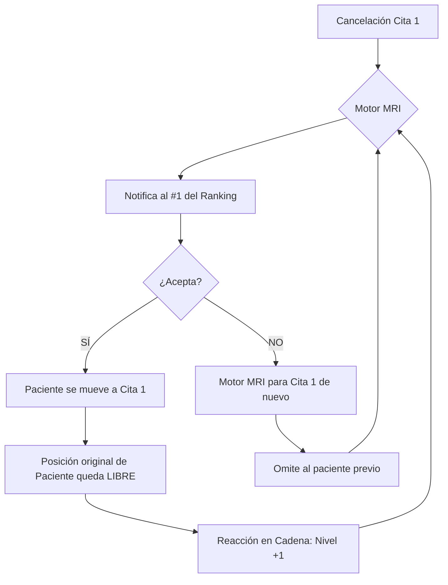

# Especificación Técnica: Motor de Reasignación Inteligente (MRI)

Este documento detalla el diseño, la lógica matemática y los mecanismos de seguridad del algoritmo de reasignación automática de citas, componente central de este Trabajo Fin de Grado.

## 1. Introducción
El **Motor de Reasignación Inteligente (MRI)** es un sistema basado en eventos diseñado para optimizar la ocupación de la agenda médica. Su función principal es detectar huecos liberados (cancelaciones) y ofrecerlos proactivamente a pacientes con citas futuras que cumplan criterios de idoneidad, reduciendo así los tiempos de espera y maximizando la eficiencia del centro.

## 2. Disparadores del Sistema (Event-Driven)
El motor se activa automáticamente ante dos eventos detectados en la capa de persistencia (Base de Datos):
1.  **Cancelación Directa:** Una cita existente pasa a estado `CANCELADA`.
2.  **Hueco por Movimiento (Reacción en Cadena):** Cuando un paciente acepta adelantar su cita, deja libre su hueco original. El sistema genera un "Hueco Fantasma" en esa posición para iniciar una nueva búsqueda.

## 3. Fase de Filtrado (Hard Constraints)
Antes de evaluar candidatos, el sistema descarta instantáneamente a aquellos que no cumplen las condiciones mínimas de viabilidad:
*   **Médico y Fecha:** Los candidatos deben pertenecer al mismo médico y tener su cita original en una fecha posterior al hueco liberado.
*   **Colisión Diaria:** Si el paciente ya tiene otra cita (de cualquier especialidad) en el mismo día del hueco ofrecido, es descartado para evitar desplazamientos innecesarios o conflictos de agenda.
*   **Estado de Propuesta:** No se ofrecen huecos a pacientes que ya tienen una propuesta `PENDIENTE` de respuesta.
*   **Memoria de Rechazo:** Si un paciente ya rechazó ese hueco específico anteriormente, no se le volverá a ofrecer (evita bucles infinitos).

## 4. El Algoritmo de Scoring (Ranking)
El sistema asigna una puntuación acumulativa basada en pesos inyectables desde la administración del hospital:

$$Puntuación = (U \cdot W_u) + (T \cdot W_t) + (A \cdot W_a)$$

Donde:
*   **$U$ (Urgencia):** Nivel declarado por el paciente o facultativo (Baja=1, Media=2, Alta=3). Su peso ($W_u$) suele ser el más alto.
*   **$T$ (Turno):** Coincidencia entre la preferencia del paciente (Mañana/Tarde) y el horario del hueco. Si coincide, suma $W_t$. Si no, penaliza con $-W_t/2$.
*   **$A$ (Antigüedad):** Días de espera restantes para su cita original. Se multiplica cada día por $W_a$ para priorizar a quienes llevan más tiempo esperando.

## 5. El Concepto de Cascada y Reacción en Cadena
El sistema no es lineal; es recursivo y persistente.

### 5.1. Cascada por Rechazo (Cascada Lateral)
Si el mejor candidato rechaza la propuesta, el sistema se activa de nuevo para el mismo hueco tras marcar al primer candidato como "excluido" para ese ID de cita. La oferta desciende así al segundo mejor clasificado.

### 5.2. Reacción en Cadena (Cascada en Profundidad)
Si el candidato **Acepta**, su cita original se libera. El sistema hereda el estado de "Hueco Libre" para esa posición antigua y dispara el motor de nuevo. Esto permite que el paciente B salte al hueco de A, y el paciente C al de B.

## 6. Finalización y Seguridad (Circuit Breaker)

El proceso de reasignación no es infinito y cuenta con dos mecanismos de parada:

### 6.1. Finalización Natural
La cadena de reasignación finaliza de forma natural cuando:
*   **Agotamiento de Candidatos:** No existen más pacientes citados en fechas posteriores al último hueco liberado para ese médico.
*   **Falta de Interés:** El tiempo de respuesta (TTL) expira sin que el paciente acepte el cambio, o todos los candidatos idóneos rechazan la propuesta.

### 6.2. Circuit Breaker (Cortafuegos Técnico)
Para evitar que una reacción en cadena genere una carga excesiva en escenarios de agendas masivas, el sistema almacena el `nivel_cascada` de forma persistente en la base de datos:
1.  **Persistencia:** El contador se guarda en la tabla `Cita`, garantizando que la traza se mantenga aunque la aceptación ocurra días después.
2.  **Límite de Profundidad:** El motor solo permite una reacción en cadena de hasta **5 niveles**. Una vez alcanzado este límite, el hueco liberado se mantiene como libre en la agenda pero no dispara más notificaciones automáticas de adelanto.

## 7. Flujo de Notificación
Las propuestas tienen un **TTL (Time To Live) de 24 horas**. Transcurrido ese tiempo sin respuesta del paciente, el sistema marca la propuesta como `EXPIRADA` y libera el hueco para que el motor pueda procesar al siguiente candidato.

---
**Nota Técnica:** Este algoritmo ha sido validado mediante scripts de simulación automatizada para escenarios de múltiples saltos (Reacción en Cadena), confirmando la correcta propagación de los niveles de cascada y la detención por Circuit Breaker.
